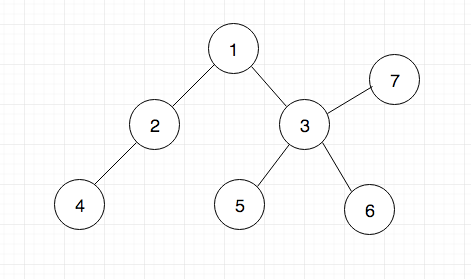

<!-- $theme: gaia -->

# 완전탐색 - BFS

---

# 목차
1. 완전탐색
	1. 완전 탐색이란?
	2. 조건
	3. 방법
2. BFS
	1. 개념
	2. 구현(while)
	3. 구현(재귀함수)
	4. Futher

---

# 1.1. 완전탐색이란?

`그래프 탐색 알고리즘`



시작점 5에서 시작해서 2를 찾는 방법..?

---

# 1.2. 완전탐색 조건(=정의)
그래프의 `1)모든 정점`을 `2)한번씩` 방문

---

# 1.3. 완전탐색 방법


---

# 2.1. BFS 개념

```python
def BFS(그래프, 목적 값):
    visited = list(그래프의 길이만큼)
    
    queue = [] # 큐를 준비함
    
    # 첫 번째 노드 방문
    queue.append(s)
    visited[s] = True
    
    while queue:
        s = queue.pop(0) # 첫번째 값을 가져옴
        print(s, end = " ") # 방문지점 출력
        
        for i in 그래프:
            if 방문하지 않았으면:
                큐에 추가, visited에 체크
    
```
---

# 2.2. BFS 구현1(while)

그래프 준비
```python
from collections import defaultdict 

# 그래프 준비
graph = defaultdict(list) 

# 그래프에 엣지를 추가하는 함수
def addEdge(graph,u,v): 
    graph[u].append(v)


```

---

# 2.2. BFS 구현2(while)

```python
def BFS(graph, s): 
    visited = [False] * (len(graph)) # 방문여부 체크
  
    # Create a queue for BFS 
    queue = []
    queue.append(s) 
    visited[s] = True
  
    while queue:
        s = queue.pop(0)
        print (s, end = " ") 
  
        for i in graph[s]: 
            if visited[i] == False: 
                queue.append(i) 
                visited[i] = True
    print("")
```

---

# 2.3. 구현(재귀함수)

---

# 2.4. Futher
## 재귀함수가 느린 이유

```


```